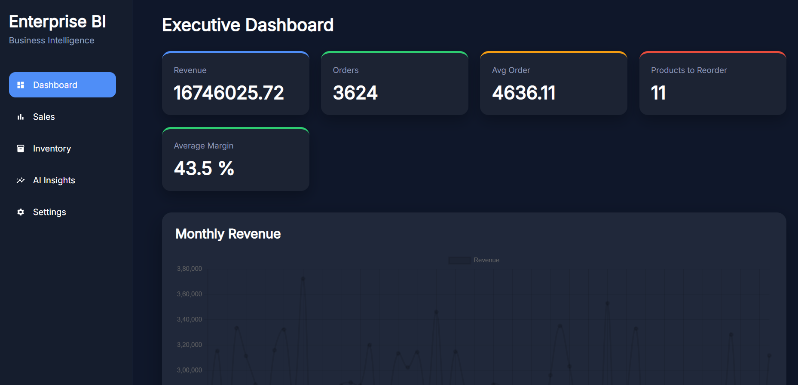
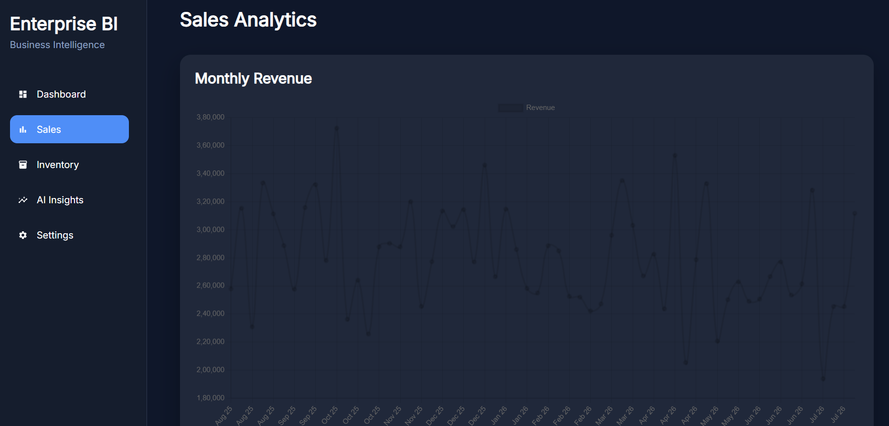
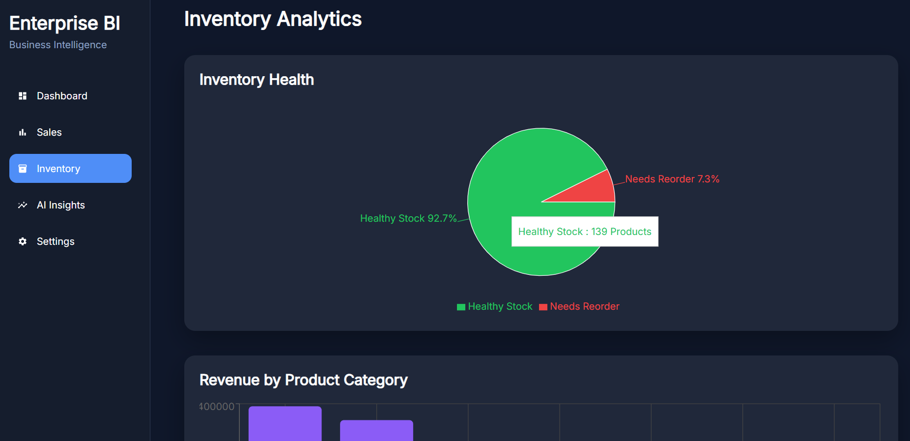
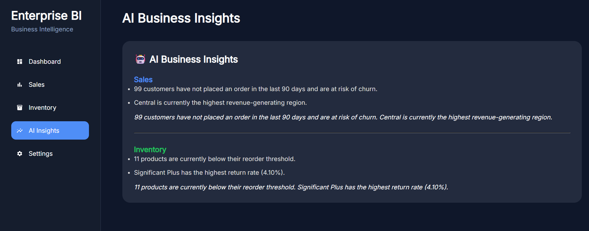

# 📊 Enterprise Business Intelligence & Data Engineering Platform

An end-to-end Business Intelligence (BI) and Data Engineering platform that transforms raw sales and inventory data into interactive dashboards and AI-powered business insights. The project demonstrates a modern analytics pipeline using Python ETL, PostgreSQL, dbt, FastAPI, React, and Docker.

Developed by a 2-member team, where each member owns a separate business domain while collaborating on the shared data warehouse, backend APIs, frontend dashboard, and deployment.

---

# 📸 Screenshots

## Executive Dashboard



---

## Sales Analytics



---

## Inventory Analytics



---

## AI Business Insights



---

## 🚀 Project Overview
The platform follows a modern enterprise analytics workflow:

```text
CSV Data Sources
        │
        ▼
Python ETL Pipelines
        │
        ▼
PostgreSQL Data Warehouse
(Raw → Staging → Marts)
        │
        ▼
dbt Transformations
        │
        ▼
FastAPI REST APIs
        │
        ▼
React Dashboard
        │
        ▼
AI Business Insights

```

The architecture demonstrates how raw operational data is transformed into analytics-ready datasets for executive reporting and business decision-making.

---

## 🌟 Key Highlights

* End-to-end Business Intelligence Platform
* Layered PostgreSQL Data Warehouse
* Python ETL Pipelines with Data Validation
* dbt Analytical Models
* FastAPI REST APIs
* React Dashboard with Interactive Charts
* AI-generated Business Insights
* Modular Component-based Architecture
* Dockerized Development Environment

---

## ✨ Features

### ✅ Enterprise Data Warehouse

* Raw Layer
* Staging Layer
* Marts Layer
* PostgreSQL Warehouse
* Schema-driven Database Design
* Dockerized Environment

### ✅ Synthetic Data Generation

Automatically generates realistic datasets for:

* Customers
* Employees
* Orders & Order Lines
* Products
* Suppliers
* Inventory
* Returns

### ✅ Python ETL Pipelines

**Sales & Customer Analytics**

* Data Extraction & Validation
* Duplicate Removal
* Missing Value Handling
* Revenue Calculation
* PostgreSQL Loading

**Product & Inventory Analytics**

* Product Validation
* Inventory Processing
* Supplier Cleaning
* Returns Processing
* Inventory Standardization
* PostgreSQL Loading

### ✅ Data Quality

The ETL pipelines perform:

* Duplicate Removal
* Missing Value Handling
* Invalid Record Filtering
* Data Type Conversion
* Business Rule Validation

### ✅ dbt Analytical Models

Business-ready analytical models include:

* Monthly Revenue
* Customer Lifetime Value (CLV)
* Salesperson Performance
* Product Profitability
* Inventory Health
* Return Analysis

### ✅ FastAPI REST APIs

* **Sales APIs:** Monthly Revenue, Revenue by Region, Sales KPIs, Top Customers, Salesperson Performance
* **Inventory APIs:** Inventory Health, Product Profitability, Product Category Revenue, Inventory Status, Return Analysis
* **AI APIs:** Sales Insights, Inventory Insights

### ✅ Interactive React Dashboard

* **Pages:** Executive Dashboard, Sales Analytics, Inventory Analytics, AI Business Insights, Settings
* **Visualizations:** KPI Cards, Monthly Revenue Trend, Revenue by Region, Inventory Health, Product Category Revenue, Top Customers, Salesperson Performance, Inventory Status, Product Profitability, Return Analysis, AI-generated Business Insights

---

## 🛠 Tech Stack

| Category | Technology |
| --- | --- |
| **Programming** | Python |
| **Backend** | FastAPI |
| **Frontend** | React + Vite |
| **Database** | PostgreSQL |
| **ORM** | SQLAlchemy |
| **ETL** | Pandas |
| **Data Transformation** | dbt |
| **Charts** | Recharts |
| **HTTP Client** | Axios |
| **Routing** | React Router |
| **SQL** | PostgreSQL |
| **Containerization** | Docker |
| **Orchestration** | Apache Airflow |
| **Version Control** | Git & GitHub |

---

## 📂 Project Structure

```text
EBI-DEP/
│
├── api/
│   ├── routers/
│   ├── db.py
│   ├── main.py
│   └── requirements.txt
│
├── dashboard/
│   ├── src/
│   │   ├── api/
│   │   ├── components/
│   │   │   ├── charts/
│   │   │   ├── common/
│   │   │   ├── dashboard/
│   │   │   └── tables/
│   │   ├── hooks/
│   │   ├── pages/
│   │   ├── services/
│   │   ├── styles/
│   │   ├── App.jsx
│   │   └── main.jsx
│   ├── package.json
│   └── vite.config.js
│
├── data/
│   ├── generate_data.py
│   ├── etl_sales.py
│   ├── etl_inventory.py
│   └── db.py
│
├── dbt_project/
│
├── dags/
│
├── docker/
│
├── sql/
│
├── docker-compose.yml
│
└── README.md

```

---

## ⚙️ Installation

**1. Clone Repository**

```bash
git clone https://github.com/venumadhavnadavala/EBI-DEP.git
cd EBI-DEP

```

**2. Backend Setup**

```bash
cd api
pip install -r requirements.txt
uvicorn main:app --reload

```

* **Backend runs at:** `http://localhost:8000`
* **Swagger Documentation:** `http://localhost:8000/docs`

**3. Frontend Setup**

```bash
cd dashboard
npm install
npm run dev

```

* **Frontend runs at:** `http://localhost:5173`

**4. Production Build**

```bash
npm run build

```

---

## ✅ Completed Features

* PostgreSQL Data Warehouse (Layered Warehouse Architecture)
* Synthetic Data Generator
* Python ETL Pipelines (Raw → Staging → Marts Workflow)
* dbt Analytical Models
* FastAPI REST APIs
* React Dashboard (Executive Dashboard, Sales Analytics, Inventory Analytics, AI Business Insights)
* Dockerized Deployment
* Apache Airflow DAGs

---

## 👨‍💻 Team Responsibilities

### Venu Madhav Nadavala

* **Sales & Customer Analytics:** Sales ETL Pipeline, Customer ETL Pipeline, Sales dbt Models, Sales REST APIs, Sales Dashboard, AI Sales Insights

### Karthik Dommaraju

* **Product & Inventory Analytics:** Inventory ETL Pipeline, Product ETL Pipeline, Inventory dbt Models, Inventory REST APIs, Inventory Dashboard, AI Inventory Insights

### Shared Responsibilities

* PostgreSQL Warehouse & Database Design
* Docker & Deployment
* FastAPI Backend
* React Dashboard
* AI Insights Engine

---

## 🚀 Future Enhancements

* JWT Authentication
* Role-Based Access Control
* CSV / Excel Export
* Email Reports
* Predictive Analytics
* Cloud Deployment (AWS)
* CI/CD Pipeline
* Real-time Streaming Analytics

---

## 👨‍💻 Developed By

**Venu Madhav Nadavala** & **Karthik Dommaraju**

*B.Tech, IIT Tirupati*

---

## 📄 License

This project is intended for educational and portfolio purposes.

```

```
